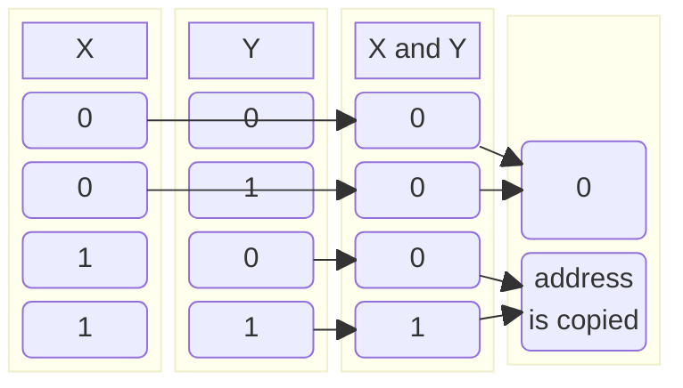
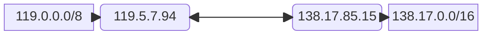

# Host-to-host delivery

In the datagram approach to packet switching, each packet is treated
independently of all others. Packets in this approach are referred to as
**datagrams.**

The identifier used in the network layer of the internet model to identify each
device connected to the internet is called the **internet address** or
**IP address.**

In the binary notation, the IP address is displayed as $32 \ \textsf{bits}$.

Internet addresses are usually written in decimal form with a dot separating the
bytes.

Binary | Decimal
--- | ---:
$\texttt{00000001}$ | $2^{0} = 1$
$\texttt{00000010}$ | $2^{1} = 2$
$\texttt{00000100}$ | $2^{2} = 4$
$\texttt{00001000}$ | $2^{3} = 8$
$\texttt{00010000}$ | $2^{4} = 16$
$\texttt{00100000}$ | $2^{5} = 32$
$\texttt{01000000}$ | $2^{6} = 64$
$\texttt{10000000}$ | $2^{7} = 128$

> #### Example 1
>
> > Change the following IP addresses from binary notation to dotted-decimal
    notation.
> >
> > 1.  $\texttt{10000001 00001011 00001011 11101111}$
>
> $$
> \begin{align}
>   \underbrace{\texttt{10000001}}_{2^{7} + 2^{0}} \
>   \underbrace{\texttt{00001011}}_{2^{3} + 2^{1} + 2^{0}} \
>   \underbrace{\texttt{00001011}}_{2^{3} + 2^{1} + 2^{0}} \
>   \underbrace{\texttt{11101111}}_{2^{7} + 2^{6} + 2^{5} + 2^{3} + 2^{2} + 2^{1} + 2^{0}} \
>   &= \\
>   (128 + 1) \ (8 + 2 + 1) \ (8 + 2 + 1) \ (128 + 64 + 32 + 8 + 4 + 2 + 1) &= \texttt{129.11.11.239}
> \end{align}
> $$
>
> > 2.  $\texttt{11111001 10011011 11111011 00001111}$
>
> $$
> \begin{align}
>   \underbrace{\texttt{11111001}}_{2^{7} + 2^{6} + 2^{5} + 2^{4} + 2^{3} + 2^{0}} \
>   \underbrace{\texttt{10011011}}_{2^{7} + 2^{4} + 2^{3} + 2^{1} + 2^{0}} \
>   \underbrace{\texttt{11111011}}_{2^{7} + 2^{6} + 2^{5} + 2^{4} + 2^{3} + 2^{1} + 2^{0}} \
>   \underbrace{\texttt{00001111}}_{2^{3} + 2^{2} + 2^{1} + 2^{0}} \
>   &= \\
>   (128 + 64 + 32 + 16 + 8 + 1) \ (128 + 16 + 8 + 2 + 1) \ (128 + 64 + 32 + 16 + 8 + 2 + 1) \ (8 + 4 + 2 + 1) &= \texttt{249.155.251.15}
> \end{align}
> $$

> #### Example 2
>
> > Change the following IP addresses from dotted-decimal notation to binary
    notation.
> >
> > 1.  $\texttt{111.56.45.78}$
>
> $$
> \begin{align}
>   \underbrace{\texttt{111}}_{64 + 32 + 8 + 4 + 2 + 1} \
>   \underbrace{\texttt{56}}_{32 + 16 + 8} \
>   \underbrace{\texttt{45}}_{32 + 8 + 4 + 1} \
>   \underbrace{\texttt{78}}_{64 + 8 + 4 + 2} \
>   &= \\
>   (2^{6} + 2^{5} + 2^{3} + 2^{2} + 2^{1} + 2^{0}) \
>   (2^{5} + 2^{4} + 2^{3}) \
>   (2^{5} + 2^{3} + 2^{2} + 2^{0}) \
>   (2^{6} + 2^{3} + 2^{2} + 2^{1}) &= \texttt{01101111.00111000.00101101.01001110}
> \end{align}
> $$
>
> > 2.  $\texttt{75.45.34.78}$
>
> $$
> \begin{align}
>   \underbrace{\texttt{75}}_{64 + 8 + 2 + 1} \
>   \underbrace{\texttt{45}}_{32 + 8 + 4 + 1} \
>   \underbrace{\texttt{34}}_{32 + 2} \
>   \underbrace{\texttt{78}}_{64 + 8 + 4 + 2} \
>   &= \\
>   (2^{6} + 2^{3} + 2^{1} + 2^{0}) \
>   (2^{5} + 2^{3} + 2^{2} + 2^{0}) \
>   (2^{5} + 2^{1}) \
>   (2^{6} + 2^{3} + 2^{2} + 2^{1}) &= \texttt{01001011.00101101.00100010.01001110}
> \end{align}
> $$

If the address is given in **binary notation,** the first few bits can
immediately tell us the class of the address.

Class | 1st byte
--- | ---
A | $\texttt{0} \dots \texttt{127}$
B | $\texttt{128} \dots \texttt{191}$
C | $\texttt{192} \dots \texttt{223}$
D | $\texttt{224} \dots \texttt{239}$
E | $\texttt{240} \dots \texttt{255}$

> #### Example 3
>
> > Find the class of each address:
> >
> > 1.  00000001 00001011 00001011 11101111
>
> $$
> \begin{align}
>   \underbrace{\texttt{00000001}}_{2^{0}} &= 1 \\
>   0 \leq 1 \leq 127 &\Rightarrow \textbf{Class A} \\
> \end{align}
> $$
>
> > 2.  11110011 10011011 11111011 00001111
>
> $$
> \begin{align}
>   \underbrace{\texttt{11110011}}_{2^{7} + 2^{6} + 2^{5} + 2^{4} + 2^{1} + 2^{0}} &= \\
>   128 + 64 + 32 + 16 + 2 + 1 &= 243 \\
> 240 \leq 243 \leq 255 &\Rightarrow \textbf{Class E} \\
> \end{align}
> $$

When the address is given in the **dotted-decimal notation,** then we need to
look only at the first byte to determine the class of the address.

> #### Example 4
>
> > Find the class of each address:
> >
> > 1.  $\texttt{227.12.14.87}$
>
> $$
> 224 \leq 227 \leq 239 \Rightarrow \textbf{Class D}
> $$
>
> > 2.  $\texttt{252.5.15.111}$
>
> $$
> 240 \leq 252 \leq 255 \Rightarrow \textbf{Class E}
> $$
>
> > 3.  $\texttt{134.11.78.56}$
>
> $$
> 128 \leq 134 \leq 191 \Rightarrow \textbf{Class B}
> $$

Addresses in classes A, B and C are for **unicast communication,** from one
source to one destination.

Addresses in class D are for **multicast communication,** from one source to a
group of destinations.

Addresses in class E are reserved.

Class | Net ID | Host ID
--- | --- | ---
A | $1 \ \textsf{byte}$ | $3 \ \textsf{bytes}$
B | $2 \ \textsf{bytes}$ | $2 \ \textsf{bytes}$
C | $3 \ \textsf{bytes}$ | $1 \ \textsf{byte}$

### Class A

Class A is divided into $128 \ \textsf{blocks}$ with each block having a
different net ID. The **first block** covers addresses from

$$
\texttt{0.0.0.0} \to \texttt{0.255.255.255}
$$

The second block covers addresses

$$
\texttt{1.0.0.0} \to \texttt{1.255.255.255}
$$

Class A addresses were designed for large organizations with a large number of
hosts or routers. The number of addresses in each block is $16777216$.

### Class B

Class B is divided into $16384 \ \textsf{blocks}$ with each block having a
different net ID. $16 \ \textsf{blocks}$ are reserved for frame addresses,
leaving $16368 \ \textsf{blocks}$ for assignment to organizations. The first
block covers addresses from

$$
\texttt{128.0.0.0} \to \texttt{128.0.255.255}
$$

The last block covers addresses from

$$
\texttt{191.255.0.0} \to \texttt{191.255.255.255}
$$

### Class C

Class C is divided into $2097152 \ \textsf{blocks}$ with each block having a
different net ID. $256 \ \textsf{blocks}$ are used for private addresses,
leaving $2096896 \ \textsf{blocks}$ for assignment to organizations.

Each block in class C contains $256 \ \textsf{addresses}$.

## Network address

The **network address** is an address that defines the network itself. It can
not be assigned to a host.

Properties of the network address:

1.  All host ID bytes are $0 \textsf{s}$.
1.  The network address defines the network to the rest of the internet.
1.  The network address is the first address in the block.

> #### Example 5
>
> > Given the address $\texttt{23.56.7.91}$, find the network address.
>
> $$
> 0 \leq 23 \leq 127 \Rightarrow \textsf{Class A}
> $$
>
> The class is A. Only the first byte defines the netid. We can find the network
  address by replacing the host id bytes ($\texttt{56.7.91}$) with
  $0 \textsf{s}$. Therefore, the network address is $\texttt{23.0.0.0}$.

> #### Example 6
>
> > Given the address $\texttt{132.6.17.85}$, find the network address.
>
> $$
> 128 \leq 132 \leq 191 \Rightarrow \textsf{Class B}
> $$
>
> In class B, the first two bytes define the netid. We can find the network
  address by replacing the hostid bytes ($\texttt{17.85}$) with $0 \textsf{s}$.
  Therefore, the network address is $\texttt{132.6.0.0}$.

> #### Example 7
>
> > Given the address $\texttt{17.0.0.0}$, find the class.
>
> The class is A because the netis is only the first byte.

The routers outside the organization route the packet based on the network
address. The router inside the organization routes the packet based on the
subnet address.

A 32-bit number called the **mask** is the routing key.

A **default mask** is a 32-bit number that gives the network address when AND-ed
with an address in the block.

> #### Example 8
>
> > A router outside the organization receives a packet with destination
    address $\texttt{190.240.7.91}$. Show how it finds the network address to
    route the packet.
>
> The router follows three steps:
>
> 1.  The router looks at the first byte of the address to find the class.
>     $$
>     128 \leq 190 \leq 191 \Rightarrow \textsf{Class B}
>     $$
> 1.  The default mask for class B is $\texttt{255.255.0.0}$. The router ANDs
      this mask with the address to get $\texttt{190.240.0.0}$.
> 1.  The router looks in its routing table to find out how to route the packet
      to this destination. Later, we will see what happens if this destination
      does not exist.

## Subnet mask

The number of $1 \textsf{s}$ in a subnet mask is greater than the number of
$1 \textsf{s}$ in the corresponding default mask.

If the number of subnets is $N$, the number of extra $1 \textsf{s}$ is
$\log_{2} N$

$$
\begin{align}
  N = 4 &&&& \log_{2} 4 = 2 \\
  N = 8 &&&& \log_{2} 8 = 3 \\
  N = 16 &&&& \log_{2} 16 = 4 \\
\end{align}
$$

> #### Example 9
>
> > A router inside the organization receives the same packet with destination
    address $\texttt{190.240.33.91}$. Show how it finds the subnetwork address
    to route the packet.
>
> The router follows three steps:
>
> 1.  The router must know the mask. We assume it is $\texttt{/19}$, as shown in
      *Figure 19.23.*
> 1.  The router applies the mask to the address.
>     $$
>     \begin{align}
>       \texttt{33} =& \texttt{00100001} \\
>       \texttt{/19} =& \underline{\texttt{11100000}} \\
>       & \texttt{00100000} = \\
>       & 2^{5} = \mathbf{32}
>     \end{align}
>     $$
>     The subnet address is $\texttt{190.240.32.0}$.
> 1.  The router looks in its routing table to find how to route the packet to
      this destination. Later, we will see what happens if this destination does
      not exist.

The default mask creates the network address, the subnet mask creates the
subnetwork address. Given an IP address, we can find the subnet address the same
way we found the network address, we apply the mask to the address.

> #### Example 10
>
> > What is the subnetwork address if the destination address is
    $\texttt{200.45.34.56}$ and the subnet mask is $\texttt{255.255.240.0}$?
>
> We apply AND operation on the address and the subnet mask.
>
> $$
> \begin{align}
>   \texttt{200.45.34.56} &= \\
>   (128 + 64 + 8) \ (32 + 8 + 4 + 1) \ (32 + 2) \ (32 + 16 + 8) &= \\
>   (2^{7} + 2^{6} + 2^{3}) \ (2^{5} + 2^{3} + 2^{2} + 2^{0}) \ (2^{5} + 2^{1}) \ (2^{5} + 2^{4} + 2^{3}) &= \texttt{11001000 00101101 00100010 00111000}
> \end{align}
> $$
>
> $$
> \begin{align}
>   \texttt{255.255.240.0} &= \\
>   (128 + 64 + 32 + 16 + 8) \ (128 + 64 + 32 + 16 + 8) \ (128 + 64) \ (0) &= \\
>   (2^{7} + 2^{6} + 2^{5} + 2^{4} + 2^{3}) \ (2^{7} + 2^{6} + 2^{5} + 2^{4} + 2^{3}) \ (2^{7} + 2^{6}) \ (0) &= \texttt{11111111 11111111 11110000 00000000}
> \end{align}
> $$
>
> $$
> \begin{align}
>   \texttt{11001000 00101101 00100010 00111000} \\
>   \underline{\texttt{11111111 11111111 11110000 00000000}} \\
>   \underbrace{\texttt{11001000}}_{2^{7} + 2^{6} + 2^{3}} \
>   \underbrace{\texttt{00101101}}_{2^{5} + 2^{3} + 2^{2} + 2^{0}} \
>   \underbrace{\texttt{00100000}}_{2^{5}} \
>   \underbrace{\texttt{00000000}}_{0} &= \\
>   (128 + 64 + 8) \ (32 + 8 + 4 + 1) \ (32) \ (0) &= \texttt{200.45.32.0}
> \end{align}
> $$

The number of subnets can be found by counting the extra $1 \textsf{s}$ that are
added to the default mask. For example, if the number of extra $1 \textsf{s}$
is $3$, the number of subnets is $2^{3} = 8$.

The number of addresses per subnetwork can be found by counting the number of
$0 \textsf{s}$ in the subnet mask. If the number of $0 \textsf{s}$ is $13$,
the number of addresses in each subnet is $2^{13} = 8192$.

Two addresses in each subnet are added to the list of special addresses. The
first address in each subnet (with hostid all $0 \textsf{s}$) is the subnet
address. The last address in each subnet (with hostid all $1 \textsf{s}$) is
reserved for broadcast inside the subnet.

In **supernetting,** an organization can combine several class C blocks to
create a larger range of addresses. Several networks are combined to create a
**supernetwork.**

When an organization is granted a block of addresses, the first address in the
block and the mask define the block (the range of addresses).

The notation $\texttt{195.14.192.3/24}$ shows a class C address, but the address
$\texttt{195.14.192.3/21}$ shows that the address belongs to the supernet with
the mask $\texttt{255.255.248.0}$.

The device that is connected to different networks is called a
**multihomed computer (device)** and will have more than one address.

An internet address defines the connection of a device to a specific network.
Moving a device (computer) from one network to another means that its IP address
must be changed.

The first address in a block defines the **network address.**

If the hostid is all $1 \textsf{s}$, the address is called a
**direct broadcast address.** It is used to send a packet to all hosts in a
specific network. All hosts will accept a packet, having this type of
destination address.

### Limited broadcast address

An address with all $1 \textsf{s}$ for the netid and hostid
($32 \ \textsf{bits}$) defines a broadcast address in the current network. A
host that wants to send a message to every other host can use this address as a
destination address in an IP packet. A router will block a packet, having this
type of address to confine broadcasting to the local network.

The IP address with the first byte equal to $127$ is used for the
**loopback address,** which is an address used to test software on a machine.
When this address is used, a packet never leaves the machine, it simply returns
to the protocol software.
